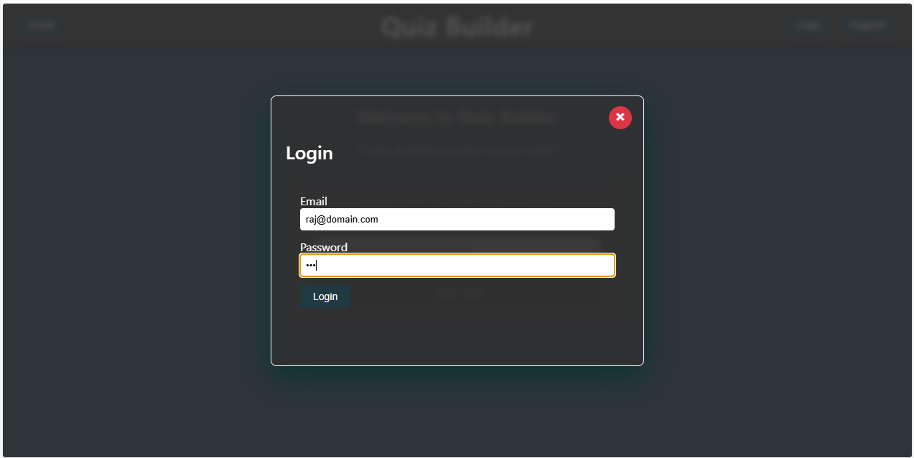
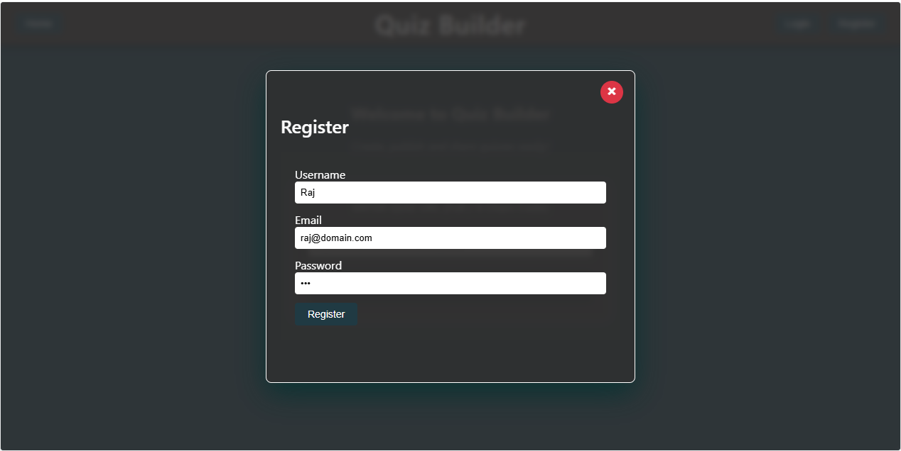
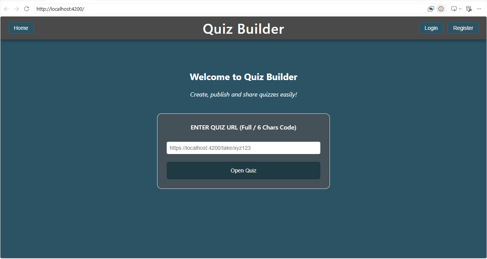
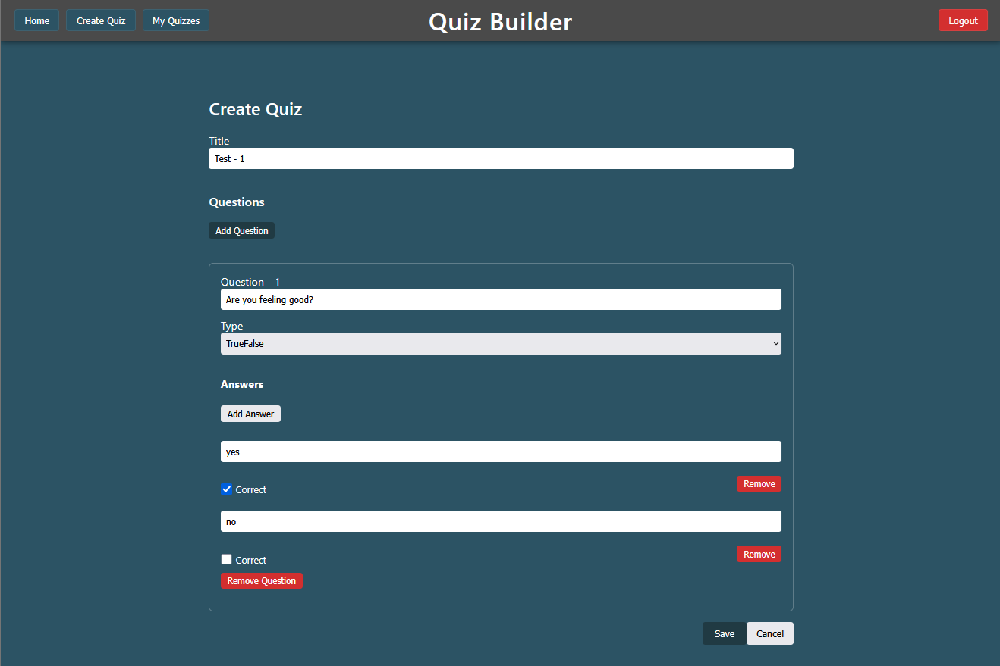
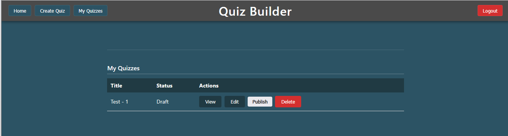
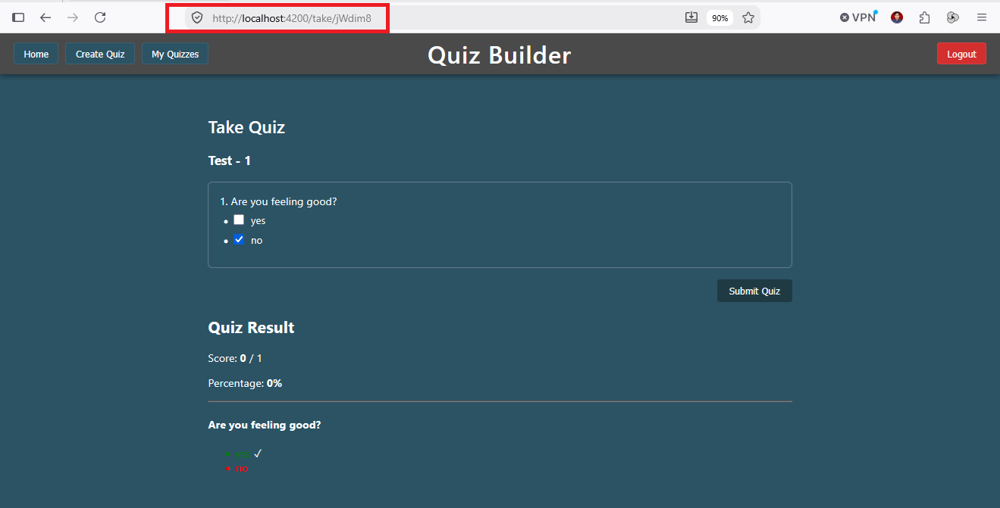
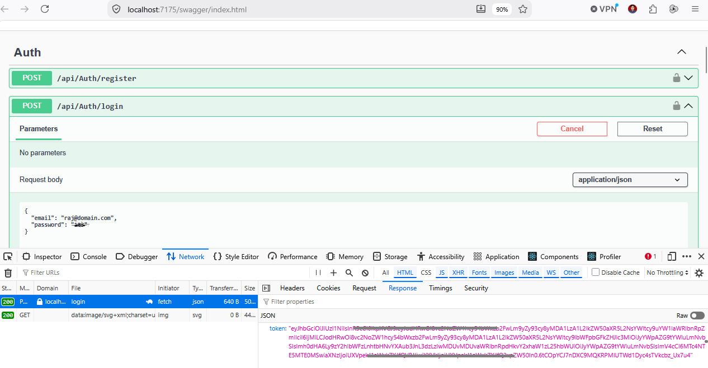
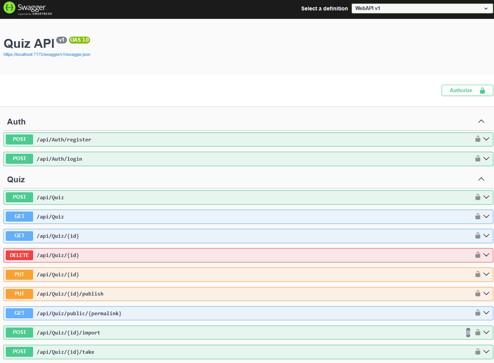

------------------------------------------------------------
                    QUIZ BUILDER
------------------------------------------------------------

Hero Banner

Project Overview

Live Demo (Optional)

Technology Stack

Key Features

Engineering Design Process
    • Requirement Decomposition
    • Domain Entity Mapping
    • Application Workflow & API Design

Solution Architecture

Project Structure

Application Screenshots

REST API Documentation

Engineering Highlights

Installation

Future Enhancements

Author


# 🎯 Quiz Builder

> A full-stack Quiz Management Platform built with **ASP.NET Core Web API**, **Angular**, and **SQL Server**, following modern software engineering and clean architecture principles.


## 📖 Project Overview

Quiz Builder is a full-stack web application that enables users to create, manage, publish, and attempt quizzes through an intuitive web interface.

The project demonstrates end-to-end software engineering practices, including requirement analysis, domain modelling, REST API design, secure authentication, frontend development, and SQL Server integration.

The solution was developed following a structured engineering approach rather than jumping directly into implementation.

## 🛠 Technology Stack

### Backend

- ASP.NET Core Web API
- C#
- Entity Framework Core
- LINQ
- Dependency Injection

### Frontend

- Angular
- TypeScript
- HTML5
- CSS3
- Bootstrap

### Database

- SQL Server

### Security

- JWT Authentication
- Password Hashing
- Role-Based Authorization

### Tools

- Swagger / OpenAPI
- Visual Studio
- Git

## ✨ Key Features

- User Registration & Login
- JWT Authentication
- Quiz Creation & Management
- Question Management
- Quiz Attempt Workflow
- Automatic Score Calculation
- Secure REST APIs
- SQL Server Integration
- Responsive Angular UI

## 📋 Requirement Decomposition and Feature Identification

Business requirements were analysed and decomposed into functional capabilities before implementation.


## 🗂 Initial Domain Entity Mapping

The application domain was modelled to identify core entities, relationships and database boundaries before implementation.


## 🔄 Application Workflow and API Design

Application workflows and API interactions were designed before implementation to define user journeys, service responsibilities and communication patterns.


## 🏗 Solution Architecture

The application follows a layered architecture separating presentation, business logic and data access responsibilities.

                    Angular Application
                           │
                    HTTP / REST APIs
                           │
                ASP.NET Core Web API
                           │
         ┌─────────────────┼─────────────────┐
         │                 │                 │
 Authentication     Quiz Services     User Services
         │                 │                 │
         └─────────────────┼─────────────────┘
                           │
                  Entity Framework Core
                           │
                     SQL Server Database

QuizBuilderApp

Backend
    Controllers
    Services
    Models
    Repositories
    Data
    Authentication

Frontend
    Components
    Services
    Models

## 📷 Application Screenshots

### Authentication

| Login | Register |
|-------|----------|
|  |  |

---

### Quiz Management

| Dashboard | Create Quiz |
|------------|-------------|
|  |  |

---

### Quiz Experience

| Home | Attempt & Result Quiz |
|------|--------------|
|  |  |

---

## 🔌 REST API Documentation

The backend exposes secure RESTful APIs documented using Swagger / OpenAPI.

### Authentication



---

### Quiz APIs



## 🚀 Engineering Highlights

- Applied layered architecture to separate presentation, business logic and data access layers.
- Designed the application workflow before implementation using structured engineering practices.
- Modelled business entities and relationships before database implementation.
- Developed secure REST APIs using ASP.NET Core Web API.
- Implemented JWT-based authentication and role-based authorization.
- Built reusable Angular components for maintainable frontend development.
- Integrated SQL Server using Entity Framework Core.
- Documented APIs using Swagger/OpenAPI.

## ⚙️ Getting Started

### Backend

```bash
cd BackEnd/WebAPI
dotnet restore
dotnet run

### Frontend
cd FrontEnd
npm install
ng serve

## 🔮 Future Enhancements

- AI-powered quiz generation using OpenAI
- Quiz analytics dashboard
- Email notifications
- Cloud deployment on Microsoft Azure
- CI/CD using GitHub Actions
- Docker containerization

## 👨‍💻 Author

**Raj Kumar Arora**

Senior Full Stack Engineer | Associate Architect

Specializing in:

- ASP.NET Core
- Angular
- Azure
- SQL Server
- Microservices
- System Design
